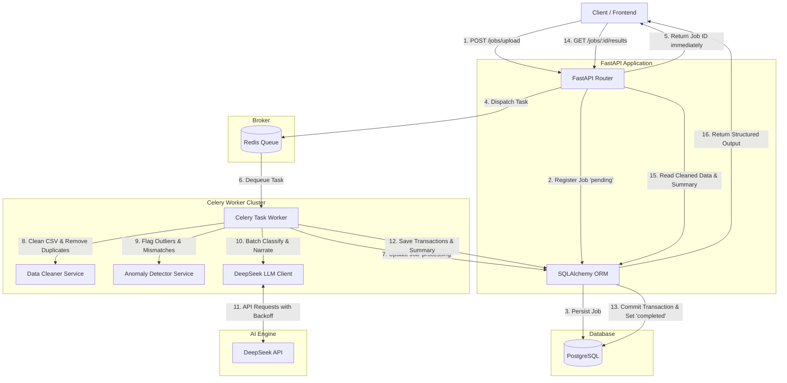

# AI-Powered Transaction Processing Pipeline

A production-grade, asynchronous financial transaction ingestion and analysis pipeline built with **FastAPI**, **Celery**, **Redis**, and **PostgreSQL**, featuring rule-based anomaly detection, intelligent **DeepSeek** classification/summarization (with exponential backoff retries and local simulation fallbacks), and containerized setup using **Docker & Docker Compose**.

---

## 📚 In-Depth Technical Documentation

To master this project and prepare for your design review, please read our in-depth documentation series located in the [docs](file:///home/keshav/alemeno/docs) directory:

1. [Doc 01: System Architecture Deep Dive](file:///home/keshav/alemeno/docs/01_system_architecture.md) — Architectural design, technology choice rationale, and detailed request lifecycle.
2. [Doc 02: Database Schema & Relational Models](file:///home/keshav/alemeno/docs/02_database_schema.md) — ER-diagrams, constraints, UUID choices, and indexing strategies.
3. [Doc 03: Data Processing & Anomaly Pipeline](file:///home/keshav/alemeno/docs/03_data_pipeline.md) — Pandas cleaning algorithms, date normalizations, and the mathematics of the 3x Median outlier rule.
4. [Doc 04: DeepSeek LLM Integration & Robustness](file:///home/keshav/alemeno/docs/04_llm_integration.md) — Batching logic, rate limit prevention, backoff retry scripts, and the local simulator failover boundaries.
5. [Doc 05: API Endpoint Specifications](file:///home/keshav/alemeno/docs/05_api_endpoints.md) — Route specifications, Swagger access, response JSON examples, and HTTP state contracts.
6. [Doc 06: Scaling, Bottlenecks & Production Evolution](file:///home/keshav/alemeno/docs/06_scaling_and_bottlenecks.md) — 100x traffic failure analysis, connection pooling, queue starvation, rate limit cooling, and production roadmaps.
7. [Doc 07: Technical Interview Preparation Q&A](file:///home/keshav/alemeno/docs/07_interview_prep_guide.md) — Study guide containing exact answers to typical senior-level interview questions and a 3-minute video layout guide.
8. [🎨 Excalidraw System Design Drawing Guide](file:///home/keshav/alemeno/README_EXCALIDRAW.md) — Step-by-step visual blueprint to draw this architecture and database schema inside Excalidraw beautifully.

---

## 🏗️ System Architecture & Data Flow



### Request Lifecycle Trace
1. **Ingestion**: The client uploads a CSV file containing transactions via `POST /jobs/upload`.
2. **Fast Validation**: The API validates that the file has a `.csv` extension and contains required columns (`merchant`, `amount`, `currency`, `status`, `account_id`).
3. **Registration**: A `Job` record with status `pending` is saved to PostgreSQL, and the job ID is returned instantly.
4. **Asynchronous Dispatch**: The raw CSV text is dispatched to Redis as a Celery task payload.
5. **Worker Execution**:
   - The Celery worker picks up the task and updates the job's status to `processing`.
   - **Data Cleaning**: The worker normalizes dates to ISO 8601, strips currency symbols, normalizes status/currencies to uppercase, fills blank categories with `"Uncategorised"`, and drops duplicate rows.
   - **Anomaly Detection**: Calculates the median spending per account in the batch. Transactions with amounts $> 3 \times \text{account median}$ are flagged. USD transactions matching domestic brands (`Swiggy`, `Ola`, `IRCTC`) are also flagged.
   - **LLM Classification**: Transactions with category `"Uncategorised"` are batched together and classified via Gemini 1.5 Flash.
   - **LLM Summary**: High-level metrics are computed and sent to Gemini to generate a 2-3 sentence spending narrative and risk level (`low`/`medium`/`high`).
   - **Persistence**: Cleaned transactions and summaries are saved in a single database transaction. The job status is updated to `completed`.
6. **Polling**: The client queries `GET /jobs/{id}/status` or `GET /jobs/{id}/results` to fetch the processed results.

---

## 📂 Project Structure

```text
alemeno/
├── app/
│   ├── __init__.py
│   ├── config.py             # Settings using Pydantic Settings
│   ├── database.py           # SQLAlchemy setup & DB session management
│   ├── main.py               # FastAPI application routers & lifespan
│   ├── models.py             # SQLAlchemy models (Job, Transaction, JobSummary)
│   ├── schemas.py            # Pydantic validation/response schemas
│   ├── tasks.py              # Celery pipeline tasks
│   ├── worker.py             # Celery worker entrypoint
│   └── services/
│       ├── __init__.py
│       ├── data_cleaner.py   # Date normalisation & CSV sanitisation
│       ├── anomaly_detector.py # Statistical outliers & currency logic
│       └── llm_client.py     # DeepSeek client with exponential backoff & simulation fallback
├── tests/
│   └── test_pipeline.py      # Pytest unit and integration test suite
├── Dockerfile                # Multi-stage optimized Dockerfile for API & Worker
├── docker-compose.yml        # Orchestration file (PostgreSQL, Redis, API, Worker)
├── requirements.txt          # Python dependencies
├── transactions.csv          # Sample dataset
└── README.md                 # Documentation
```

---

## ⚡ Quick Start (Docker Compose)

### 1. Prerequisites
- Docker and Docker Compose installed.

### 2. Environment Configuration
Create a `.env` file in the root directory:
```env
DEEPSEEK_API_KEY=your_actual_deepseek_api_key_here
```
> [!NOTE]
> **No API Key? No Problem!** The pipeline features a **Local Simulation Fallback**. If `DEEPSEEK_API_KEY` is not supplied, the system automatically runs a deterministic rule-based simulator for transaction categorization and narrative summaries. The entire job queue completes successfully without errors.

### 3. Spin Up the System
Start all services (PostgreSQL database, Redis, FastAPI Web API, Celery worker) with a single command:
```bash
docker compose up --build
```
The FastAPI server will be available at `http://localhost:8000`. The interactive API documentation is at `http://localhost:8000/docs`.

---

## 🧪 Running Tests
The repository includes a comprehensive test suite covering data cleaning, anomaly detection, simulated LLM fallbacks, and API endpoints. 

To run tests inside the container or locally:
```bash
python3 -m pytest tests/
```

---

## 📡 API Endpoints & Curl Examples

### 1. Upload CSV (`POST /jobs/upload`)
Ingests the CSV file, enqueues the job, and immediately returns the job ID.

```bash
curl -X POST "http://localhost:8000/jobs/upload" \
  -H "accept: application/json" \
  -H "Content-Type: multipart/form-data" \
  -F "file=@transactions.csv"
```
**Response (201 Created):**
```json
{
  "id": "e6f47dfc-6712-4217-91a9-b9e3a6c22150",
  "filename": "transactions.csv",
  "status": "pending",
  "row_count_raw": 0,
  "row_count_clean": 0,
  "created_at": "2026-06-22T15:30:00.123456",
  "completed_at": null,
  "error_message": null
}
```

### 2. Check Job Status (`GET /jobs/{job_id}/status`)
Returns current job status. If `completed`, it includes high-level statistics.

```bash
curl -X GET "http://localhost:8000/jobs/e6f47dfc-6712-4217-91a9-b9e3a6c22150/status"
```
**Response (200 OK):**
```json
{
  "id": "e6f47dfc-6712-4217-91a9-b9e3a6c22150",
  "filename": "transactions.csv",
  "status": "completed",
  "row_count_raw": 96,
  "row_count_clean": 86,
  "created_at": "2026-06-22T15:30:00.123456",
  "completed_at": "2026-06-22T15:30:04.789123",
  "error_message": null,
  "summary": {
    "total_spend_inr": 1390422.35,
    "total_spend_usd": 48937.12,
    "top_merchants": [
      { "merchant": "Flipkart", "count": 14 },
      { "merchant": "Amazon", "count": 12 },
      { "merchant": "Swiggy", "count": 11 }
    ],
    "anomaly_count": 8,
    "narrative": "Total spending reached 1,390,422.35 INR and 48,937.12 USD. Spending patterns were concentrated in Shopping and Travel. Moderate risk is assigned due to 8 flagged outliers, mainly USD chargers on domestic services.",
    "risk_level": "medium"
  }
}
```

### 3. Retrieve Job Results (`GET /jobs/{job_id}/results`)
Returns the complete cleaned transactions, flagged anomalies, category-based spending breakdown, and the narrative.

```bash
curl -X GET "http://localhost:8000/jobs/e6f47dfc-6712-4217-91a9-b9e3a6c22150/results"
```
**Response (200 OK):**
```json
{
  "job_id": "e6f47dfc-6712-4217-91a9-b9e3a6c22150",
  "filename": "transactions.csv",
  "status": "completed",
  "summary": {
    "total_spend_inr": 1390422.35,
    "total_spend_usd": 48937.12,
    "top_merchants": [
      { "merchant": "Flipkart", "count": 14 },
      { "merchant": "Amazon", "count": 12 }
    ],
    "anomaly_count": 8,
    "narrative": "...",
    "risk_level": "medium"
  },
  "transactions": [
    {
      "id": "e0e2e5e1-88fc-42ef-bb7a-75a7e17812cd",
      "txn_id": "TXN1065",
      "date": "2024-09-04",
      "merchant": "Flipkart",
      "amount": 10882.55,
      "currency": "INR",
      "status": "SUCCESS",
      "category": "Shopping",
      "account_id": "ACC003",
      "is_anomaly": false,
      "anomaly_reason": null,
      "llm_category": null,
      "llm_failed": false
    }
  ],
  "anomalies": [
    {
      "id": "c0a5e8e9-77ab-4312-9c3f-427c3a002bc1",
      "txn_id": "TXN1021",
      "date": "2024-02-17",
      "merchant": "Zomato",
      "amount": 2536.35,
      "currency": "USD",
      "status": "SUCCESS",
      "category": "Food",
      "account_id": "ACC001",
      "is_anomaly": true,
      "anomaly_reason": "Domestic merchant brand 'Zomato' charged in USD",
      "llm_category": null,
      "llm_failed": false
    }
  ],
  "category_breakdown": {
    "INR": {
      "Shopping": 128456.90,
      "Food": 84210.00
    },
    "USD": {
      "Food": 15024.12
    }
  }
}
```

### 4. List All Jobs (`GET /jobs`)
Retrieves all uploaded jobs. Supports filtering via query parameters.

```bash
curl -X GET "http://localhost:8000/jobs?status=completed"
```

---

## 📹 Technical Video Review Guide (For Tech Lead Interview)

Use this structured breakdown for your **3-minute screen-share review** to stand out in front of the Tech Lead.

### Part 1: System Design & Data Flow (~1 min)
*   **The Blueprint**: Show the **Mermaid Architecture Diagram** above. 
*   **Technical Reasoning ("The Why")**:
    *   **FastAPI**: Selected for its fully asynchronous event loop, native support for ASGI, and Pydantic validation (which gives compile-safe request parsing).
    *   **Celery & Redis**: Offloads I/O-bound LLM tasks and CPU-bound cleaning from the FastAPI main thread, ensuring the API remains highly responsive.
    *   **PostgreSQL**: Provides transactional ACID compliance—critical for financial datasets. Double entries are guarded using foreign keys, and indexes on `job_id` ensure high performance during result retrieval.
    *   **Decoupled Services**: Cleaning, Anomaly Detection, and LLM utilities are in isolated service modules, making them independently testable.
*   **Request Lifecycle**: Walk through a single request path: *Client Upload -> FastAPI DB Register -> Celery Task enqueue -> Immediate Response -> Worker Data Ingestion -> Anomaly Checks -> Batch LLM Classification -> DB State Commit*.

### Part 2: Bottlenecks & Scale (~2 mins)
*   **The Breaking Point (100x Scale tomorrow)**:
    1.  **Memory Exhaustion (I/O)**: Passing the entire CSV file content inside a Celery task payload will fill up Redis RAM. Furthermore, loading large CSVs into Pandas in-memory creates a major bottleneck.
    2.  **Database Connection Exhaustion**: Opening a raw SQLAlchemy connection pool per request/worker task will quickly exceed PostgreSQL's default `max_connections` (100).
    3.  **LLM Rate Limiting**: The DeepSeek API restricts Requests Per Minute (RPM) and Tokens Per Minute (TPM). 100x traffic will trigger HTTP `429 Too Many Requests` immediately.
    4.  **Worker Queue Starvation**: Small jobs will get stuck behind massive CSV jobs in a single shared Celery queue.

*   **The Next Iteration (Enterprise-Grade Architecture)**:
    1.  **Object Storage & Streaming**: Instead of passing CSV strings, save raw uploads to **AWS S3 / MinIO**. Pass only the S3 object URL to Celery. Use **Pandas chunking** (`chunksize`) or **PySpark** to process transactions as a stream rather than loading all in memory.
    2.  **Connection Pooling**: Install **PgBouncer** in front of PostgreSQL to multiplex connections, and optimize SQLAlchemy pool configurations (`pool_size=20`, `max_overflow=10`).
    3.  **Rate-Limit Management**: Put LLM calls in a dedicated Celery queue configured with **rate-limiting rate controls** (e.g., `rate_limit='10/m'`). Implement fallback models (e.g., local Llama-3 via Ollama/vLLM) when the primary API returns a 429.
    4.  **Queue Isolation**: Separate task queues: a `high-priority` queue for small/polling jobs, and a `bulk-ingestion` queue for large files.
